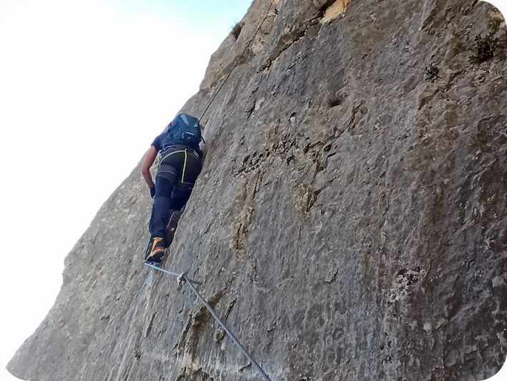

&nbsp;

:::: {.columns}
::: {.column width="40%"}

:::
::: {.column width="60%"}
&nbsp;
&nbsp;
&nbsp;
&nbsp;

## IN REAL LIFE 
* Gold medalist in jumping from one bad decision to another 

* Being born near mountains in my spare time I take the occasion to go hiking, climbing and to hang out with chamois

\vspace{3cm}

* I’ve spent way too much time around Italy rooting for my home football team Lanerossi Vicenza (what about bad decisions?)

\vspace{3cm}

* I usually face my emotional ups and downs by buying tremendous amounts of books, of questionable interest, that I accumulate in every corner of my house not having enough time to read them all

\vspace{3cm}

* Early bird habits recently forced me to start my days by trying not to sink in some swimming pool

\vspace{3cm}

* *Lockdown-induced triathlon utopia:* /ˈlɒk.daʊn ɪnˈdjuːs traɪˈæθ.lɒn juːˈtəʊ.pi.ə/  
  a period of my life during which early bird habits and multiple lockdowns are teaming up and forcing me to start running and cycling instead of swimming ([My Strava profile](https://www.strava.com/athletes/63064430))
:::
::::
