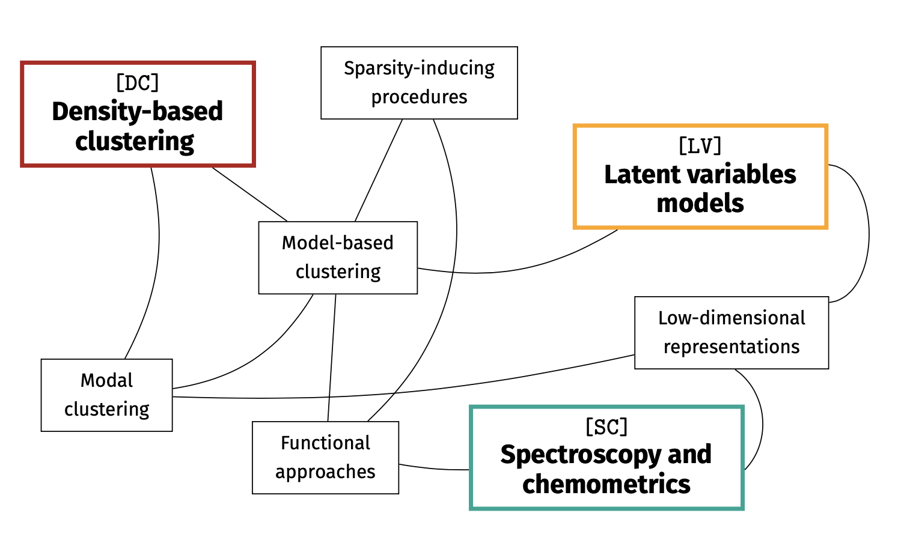

I am an Assistant Professor in Statistics (RTDa) at the Faculty of Economics and Management at the Free University of Bozen-Bolzano.  
Previously, I worked as Postdoctoral Researcher at the University College Dublin, under the supervision of Prof. Brendan Murphy and I have been affiliated both with the Insight SFI Research Centre for Data Analytics and with Vistamilk SFI Research Centre.
&nbsp; 

My full CV is available [here](documents/cv.pdf)

### Research 
My research focuses on the development of flexible statistical methodologies to model high-dimensional and complex structured data, arising from different applied frameworks. More specifically, I am particularly interested on latent variable models, on the density-based formulation of the clustering problem and on the challenges arising when dealing with spectroscopic data. Recently, I started working on inferential problems arising in high-dimensional settings as for example when dealing with spatio-temporal data.  
My main research interests are: 

* Mixture models and model-based clustering  
* Modal clustering  
* Graphical models  
* Variable selection and dimensionality reduction  
* Latent variable models  
* Computational statistics   
* Chemometrics 

<html>
  <head>
    <title>Center an Image using text align center</title>
    
  </head>
  <body>
    
 <!-- Block parent element -->
      
    

  </body>
</html>
 

### Education 
* **[2016-2020]** - PhD in Statistics, University of Padova  
&emsp;&emsp;&emsp;&emsp;&emsp;&emsp;Supervisor Prof. Giovanna Menardi  
&emsp;&emsp;&emsp;&emsp;&emsp;&emsp;Thesis title: *Climbing modes and exploring mixtures: a journey in density-based clustering* [(Link)](http://paduaresearch.cab.unipd.it/12085/)

* **[2014-2016]** - Master Degree in Statistical Sciences, University of Padova  
&emsp;&emsp;&emsp;&emsp;&emsp;&emsp;Final degree: 110/110 cum laude

* **[2011-2014]** - Bachelor Degree in Statistics, Econimics and Finance, University of Padova  
&emsp;&emsp;&emsp;&emsp;&emsp;&emsp;Final degree: 110/110 cum laude

