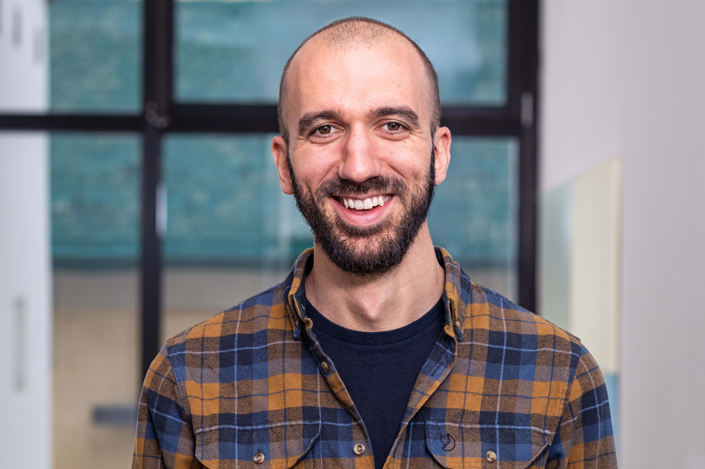

```{=html}
<link rel="stylesheet" href="https://cdnjs.cloudflare.com/ajax/libs/font-awesome/4.7.0/css/font-awesome.min.css">
<link rel="stylesheet" href="https://cdn.jsdelivr.net/gh/jpswalsh/academicons@1/css/academicons.min.css">
<style>
  .navbar {
    background-color: #f8f8f8;
    border: none;
    padding: 15px 20px;
    font-size: 17px;
  }
  .navbar a { color: #555555; margin-right: 15px; text-decoration: none; }
  .navbar-brand { font-weight: bold; font-size: 24px !important; }

  /* Container principale */
  .intro-row {
    margin-top: 80px;
    align-items: center;
  }

  /* Foto */
  .intro-photo img {
    max-height: 300px;
    width: auto;
    border-radius: 20px;
  }

  /* Testo */
  .intro-text-col {
    display: flex;
    flex-direction: column;
    justify-content: center;
    text-align: left;
  }

  .social-icons a { 
    color: #555555; 
    margin-right: 15px; 
    display: inline-block; 
  }

  /* Testo introduttivo */
  .intro-text { 
    font-size: 18px; 
    margin-top: 45px;
    text-align: left;
  }

  @media (max-width: 767px) {
    .intro-text-col { 
      text-align: center; 
      margin-top: 20px; 
    }
  }
</style>

<!-- Navbar -->
<div class="navbar navbar-default navbar-fixed-top" role="navigation">
  <div class="container">
    <div class="navbar-header">
      <button type="button" class="navbar-toggle collapsed" data-toggle="collapse" data-target="#navbar">
        <span class="icon-bar"></span><span class="icon-bar"></span><span class="icon-bar"></span>
      </button>
      <a class="navbar-brand" href="index.html">Alessandro Casa</a>
    </div>
    <div id="navbar" class="navbar-collapse collapse">
      <ul class="nav navbar-nav navbar-right">
        <li><a href="bio.html">Short bio</a></li>
        <li><a href="research.html">Publications</a></li>
        <li><a href="teaching.html">Teaching & Software</a></li>
        <li><a href="contact.html">Contact</a></li>
      </ul>
    </div>
  </div>
</div>

<!-- Sezione principale -->
<div class="container">

  <!-- Blocco sopra: foto + testo -->
  <div class="row intro-row">
    <div class="col-md-4 col-sm-12 intro-photo text-center">
      
    </div>
    <div class="col-md-8 col-sm-12 intro-text-col">
      <h2><strong>Alessandro Casa</strong></h2>
      <h4 style="color:grey;">Associate Professor of Statistics<br>Free University of Bozen-Bolzano</h4>
      <div class="social-icons" style="margin-top:10px;">
        <a href="https://scholar.google.com/citations?user=tmyUAx4AAAAJ&hl=it"><i class="ai ai-google-scholar-square ai-2x"></i></a>
        <a href="https://github.com/AlessandroCasa"><i class="fa fa-github fa-2x"></i></a>
        <a href="documents/cv.pdf" target="_blank"><i class="ai ai-cv ai-2x"></i></a>
        <a href="https://www.linkedin.com/in/alessandro-casa/"><i class="fa fa-linkedin fa-2x"></i></a>
        <a href="mailto:alessandro.casa@unibz.it"><i class="fa fa-envelope fa-2x"></i></a>
      </div>
    </div>
  </div>


  <!-- Blocco sotto: testo intero (stessa larghezza del blocco sopra) -->
  <div class="row">
    <div class="col-md-12 intro-text" style="max-width: 900px; margin: 45px auto 0 auto;">
      <p>I am an Associate Professor of Statistics at the Faculty of Economics and Management, Free University of Bozen-Bolzano (Italy). </p>

      <p>My research focuses on developing flexible statistical methodologies for modeling high-dimensional and complex structured data, arising in diverse applications. I am particularly interested in latent variable models and the density-based formulation of the clustering problem, including model-based and modal clustering techniques. I also work on the methodological challenges posed by specific data types such as spectroscopic data. My interests include graphical models, variable selection and dimensionality reduction, inferential procedures in high-dimensional settings, computational statistics, and applications in chemometrics.</p>
    
      My full CV is available <a href="documents/cv.pdf" target="_blank">here</a>.
       
      <h3><i class="fa fa-bullhorn"></i> News</h3>
      <div class="news-container">
        <div class="news-item">
          <span class="news-date-hand">[10 | 2025]</span>
          <span class="news-content-hand">Davide La Vecchia, Davide Ferrari and myself have been awarded a Swiss National Science Foundation grant for the project <i>Learning Complex Networks from Economic Data: Theory, Methods and Algorithms</i>.</span>
        </div>
        <div style="height: 10px;"></div>
        <div class="news-item">
          <span class="news-date-hand">[09 | 2025]</span>
          <span class="news-content-hand">Scientific Board Member of CLADAG (Classification and Data Analysis Group of the Italian Statistical Society) for the next two years.</span>
        </div>
        <div style="height: 10px;"></div>
        <div class="news-item">
          <span class="news-date-hand">[10 | 2024]</span>
          <span class="news-content-hand">Started my new position as Associate Professor of Statistics at the Free University of Bozen-Bolzano.</span>
        </div>
      </div>
    </div>
  </div>

</div>

```