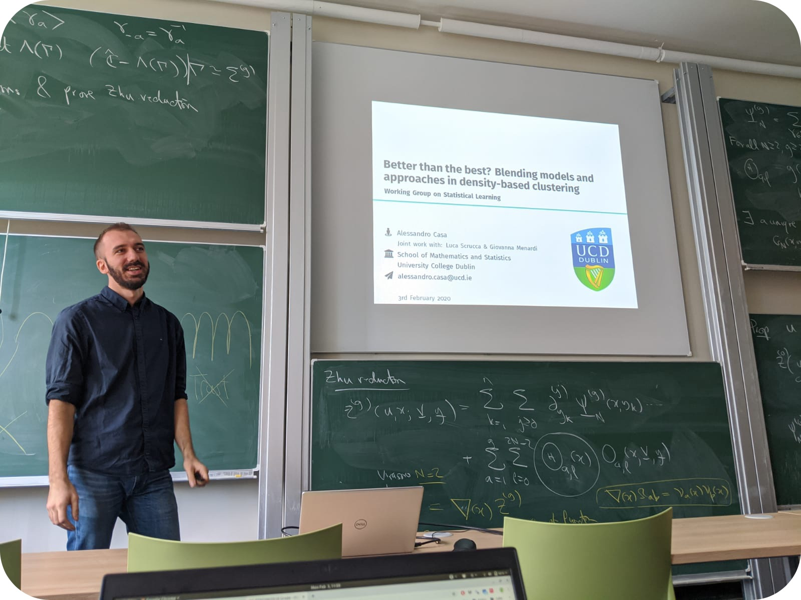

<link rel="stylesheet" href="/path/to/folder/css/academicons.min.css"/>
<link rel="stylesheet" href="https://cdn.jsdelivr.net/gh/jpswalsh/academicons@1/css/academicons.min.css">
<link rel="stylesheet" href="https://cdnjs.cloudflare.com/ajax/libs/font-awesome/4.7.0/css/font-awesome.min.css">

<html>
  <head>
    <title>Center an Image using text align center</title>
    
  </head>
  <body>
    
 <!-- Block parent element -->
      
    

  </body>
</html>
 

**ALESSANDRO CASA** 

 
Assistant Professor of Statistics  
Free University of Bozen-Bolzano

    <a href="https://scholar.google.com/citations?user=r4IIGnoAAAAJ&hl=en"><i style="color:black;" class="ai ai-google-scholar-square ai-2x"></i></a>
    &emsp;
    <a href="https://github.com/AlessandroCasa"><i style="color:black;" class="fa fa-github fa-2x"></i></a>
    &emsp;
    <a href="https://twitter.com/ale___casa"><i style="color:black;" class="fa fa-twitter fa-2x"></i></a>

